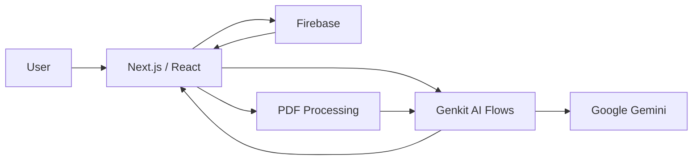
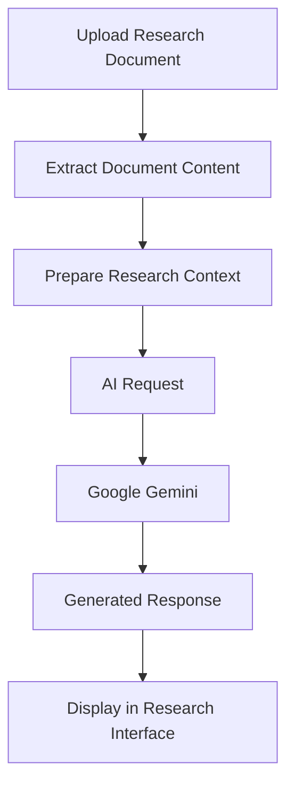

# IntelliResearch

> An AI-powered research assistant for reading, querying, and extracting insights from research documents.

[](https://nextjs.org/)
[](https://www.typescriptlang.org/)
[](https://firebase.google.com/)
[](https://ai.google.dev/)
[](https://vercel.com/)

## Overview

**IntelliResearch** is a full-stack AI research assistant designed to make working with research documents more interactive.

Instead of switching between a PDF, notes, and a separate AI chat, the application brings document processing and AI-assisted interaction into one workflow.

Users can upload research material, ask questions about their documents, generate summaries, and explore information through a conversational interface.

The application is built with **Next.js, TypeScript, Firebase, Google Gemini, and Genkit**, with PDF processing and structured validation integrated into the application stack.

---

## Why IntelliResearch?

Research documents can contain hundreds of pages, making it difficult to quickly locate a specific explanation, summarize a section, or connect information across the document.

IntelliResearch explores a simpler workflow:

```text
Research Document
       │
       ▼
   PDF Upload
       │
       ▼
Document Processing
       │
       ▼
┌───────────────────┐
│   AI Interaction  │
├───────────────────┤
│ Ask Questions     │
│ Generate Summary  │
│ Explore Content   │
└───────────────────┘
       │
       ▼
 Research Insights
```

The goal is not to replace the research process, but to make document-heavy research easier to navigate.

---

## Core Features

### Document Interaction

Upload research documents and work with their contents through the application rather than relying only on manual reading and searching.

### AI-Powered Q&A

Ask questions about research material and use the AI layer to generate responses based on the application's document workflow.

### Summarization

Generate concise summaries from research content to help extract the main ideas more quickly.

### Research Exploration

Use conversational interaction to explore information contained within uploaded material.

### Firebase Integration

Firebase is used as part of the application's backend infrastructure, including authentication and data/storage capabilities.

### Structured AI Workflows

The AI functionality is implemented using **Genkit** with Google's generative AI tooling, keeping AI-related flows separated from the main application UI.

---

## Architecture



The application separates the user interface, document processing, persistence, and AI workflow layers.

---

## AI Workflow



The repository uses **Genkit** and Google's Gemini integration for AI functionality. PDF parsing is handled through `pdf-parse`.

---

## Technical Stack

| Layer               | Technology      |
| ------------------- | --------------- |
| Framework           | Next.js 15      |
| Language            | TypeScript      |
| UI                  | React           |
| Styling             | Tailwind CSS    |
| AI Framework        | Genkit          |
| Generative AI       | Google Gemini   |
| Backend Services    | Firebase        |
| Document Processing | `pdf-parse`     |
| Forms               | React Hook Form |
| Validation          | Zod             |
| Charts              | Recharts        |
| Deployment          | Vercel          |

The versions and libraries above are based on the repository's current `package.json`.

---

## Project Structure

```text
intelliResearch-app/
├── docs/
├── src/
│   └── ai/
├── .idx/
├── apphosting.yaml
├── components.json
├── firestore.rules
├── next.config.ts
├── package.json
├── postcss.config.mjs
├── tailwind.config.ts
└── tsconfig.json
```

The `src/` directory contains the main application code, while the AI workflows are organized under `src/ai/`. The repository also includes Firebase security rules and application hosting configuration.

---

## Getting Started

### 1. Clone the repository

```bash
git clone https://github.com/sowmyadasar1/intelliResearch-app.git
cd intelliResearch-app
```

### 2. Install dependencies

```bash
npm install
```

### 3. Configure environment variables

Create a `.env.local` file and add the Firebase and Google AI configuration required by the application.

```env
# Firebase configuration
NEXT_PUBLIC_FIREBASE_API_KEY=
NEXT_PUBLIC_FIREBASE_AUTH_DOMAIN=
NEXT_PUBLIC_FIREBASE_PROJECT_ID=
NEXT_PUBLIC_FIREBASE_STORAGE_BUCKET=
NEXT_PUBLIC_FIREBASE_MESSAGING_SENDER_ID=
NEXT_PUBLIC_FIREBASE_APP_ID=

# Google AI / Genkit configuration
GOOGLE_GENAI_API_KEY=
```

> Use the exact variable names expected by the current source configuration when setting up a local environment.

### 4. Start the development server

```bash
npm run dev
```

The repository's development script runs Next.js on port `9002`.

Open:

```text
http://localhost:9002
```

### 5. Build for production

```bash
npm run build
npm start
```

---

## AI Development

The repository includes dedicated Genkit commands for developing and watching AI flows:

```bash
npm run genkit:dev
```

or:

```bash
npm run genkit:watch
```

These scripts use the AI development entry point under:

```text
src/ai/dev.ts
```

The project also includes TypeScript checking through:

```bash
npm run typecheck
```

The available scripts are defined in the repository's `package.json`.

---

## Live Demo

**[IntelliResearch](https://intelli-research-app.vercel.app/)**

---

## What I Worked On

This project gave me hands-on experience combining a modern web application with generative AI and document processing.

Key areas include:

* building a Next.js application with TypeScript
* integrating Firebase services
* working with Google's Gemini models
* creating AI workflows with Genkit
* processing PDF documents
* designing document-focused user interactions
* validating structured application input
* deploying a full-stack application through Vercel

---

## Current Scope

IntelliResearch is focused on AI-assisted interaction with research documents.

The current architecture provides a foundation for extending the application with more advanced document retrieval, research organization, and AI-assisted analysis features.

---

## Future Improvements

* More robust document retrieval and chunking
* Source-level citations for generated answers
* Multi-document research sessions
* Research history and saved conversations
* Document comparison
* Improved metadata extraction
* More detailed research analytics
* Exportable notes and summaries
* Support for additional document formats

---

## Links

* **Live Demo:** https://intelli-research-app.vercel.app/
* **GitHub:** https://github.com/sowmyadasar1/intelliResearch-app

---

## Author

**Sowmya Dasari**

Computer Science graduate interested in **data analytics, machine learning, and AI-powered applications**.

* GitHub: https://github.com/sowmyadasar1
* LinkedIn: https://linkedin.com/in/sowmyadasari1
